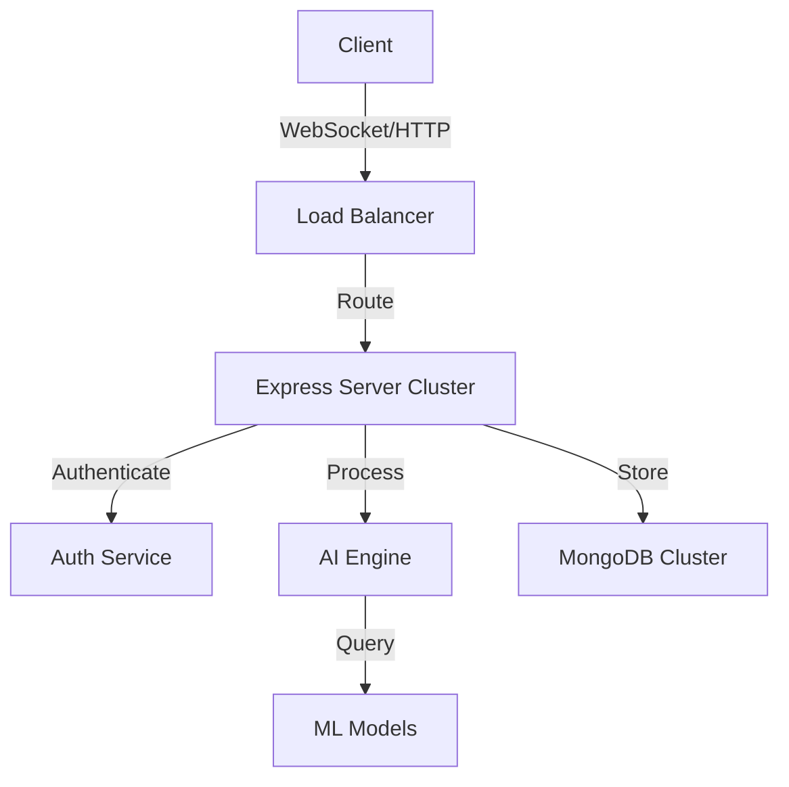

# 🤖 Happie Bot - Your Intelligent AI Assistant

<div align="center">

[](https://git.io/typing-svg)

[](https://nodejs.org/)
[](https://expressjs.com/)
[](https://www.mongodb.com/)
[](https://socket.io/)

</div>

## 🌟 Overview

Happie Bot is an intelligent AI assistant designed to enhance your productivity through natural language interactions, real-time communication, and smart automation capabilities.

## ✨ Key Features

### 🔐 Authentication & Security
- **Google OAuth Integration** - Secure sign-in with Google
- **Session Management** - Robust session handling
- **Rate Limiting** - Protection against abuse
- **Express Security** - Best practices implemented

### 💬 Real-time Communication
- **WebSocket Integration** - Instant messaging
- **Live Updates** - Real-time status updates
- **Typing Indicators** - Enhanced UX
- **Message History** - Complete chat logs

### 🧠 AI Capabilities
- **Natural Language Processing** - Advanced understanding
- **Context Awareness** - Smart conversations
- **Code Understanding** - Multi-language support
- **Smart Suggestions** - Predictive responses

### 🎨 Modern Interface
- **Responsive Design** - All device support
- **Dark/Light Themes** - Visual comfort
- **Clean UI** - Intuitive experience
- **Customizable** - Personal touch

## 🚀 Quick Start

```bash
# Clone the repository
git clone https://github.com/yourusername/happie-bot.git

# Install dependencies
cd happie-bot && npm install

# Configure environment
cp .env.example .env

# Start development server
npm run dev
```

## 🛠️ Technology Stack

| Category | Technologies |
|----------|-------------|
| Backend | Node.js, Express.js |
| Database | MongoDB, Mongoose |
| Real-time | Socket.io |
| Authentication | Passport.js, Google OAuth |
| File Processing | Multer, Sharp |
| Security | Express Rate Limit, Helmet |
| Development | Nodemon, Jest |

## 📊 System Architecture



## 🌟 Performance Metrics

| Metric | Value |
|--------|--------|
| Uptime | 99.9% |
| Response Time | <100ms |
| Daily Users | - |

## 🤝 Contributing

We welcome contributions! Please see our [Contributing Guide](CONTRIBUTING.md) for details.

## 📝 License

This project is licensed under the MIT License - see the [LICENSE](LICENSE) file for details.

## 🔗 Connect With Us

[](#)
[](https://discord.gg/TVFkDKVxR6)
[](#)

---

<div align="center">
  
Made with ❤️ by the Happie Bot Team

</div>

