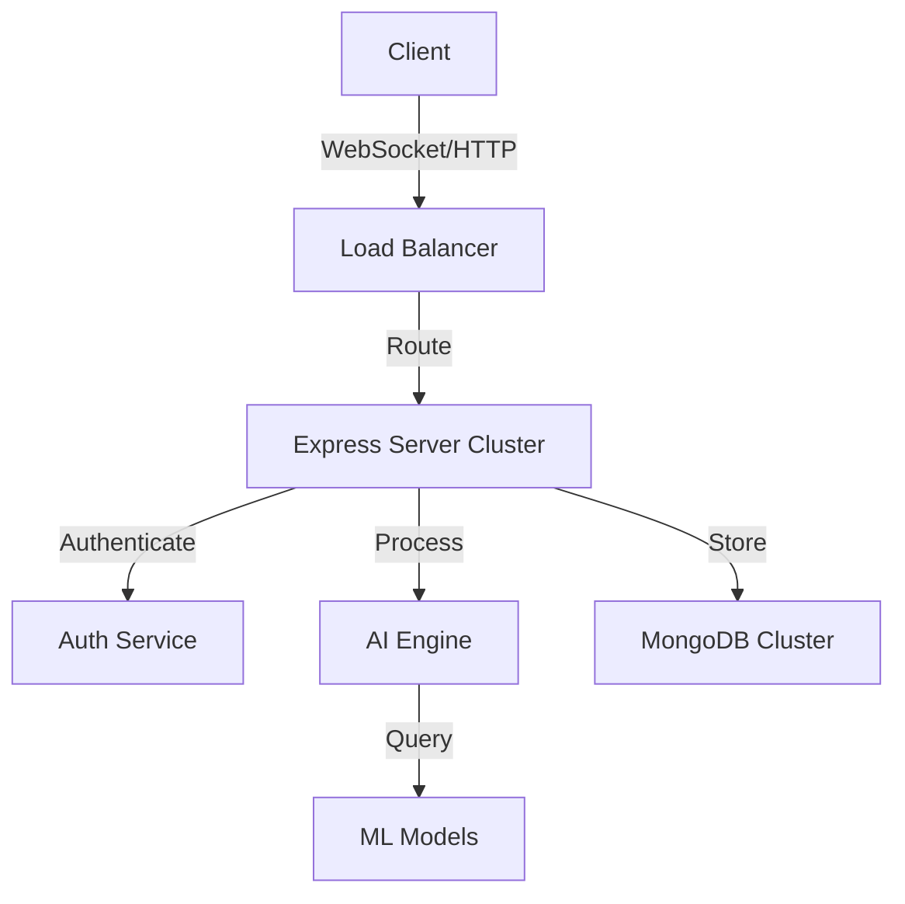

# 🤖 Happie Bot - Your Intelligent AI Assistant

<div align="center">

[](https://git.io/typing-svg)

[](https://nodejs.org/)
[](https://expressjs.com/)
[](https://www.mongodb.com/)
[](https://socket.io/)

</div>

## 🌟 Overview

Happie Bot is an intelligent AI assistant designed to enhance your productivity through natural language interactions, real-time communication, and smart automation capabilities.

## ✨ Key Features

### 🔐 Authentication & Security
- **Google OAuth Integration** - Secure sign-in with Google
- **Session Management** - Robust session handling
- **Rate Limiting** - Protection against abuse
- **Express Security** - Best practices implemented

### 💬 Real-time Communication
- **WebSocket Integration** - Instant messaging
- **Live Updates** - Real-time status updates
- **Typing Indicators** - Enhanced UX
- **Message History** - Complete chat logs

### 🧠 AI Capabilities
- **Natural Language Processing** - Advanced understanding
- **Context Awareness** - Smart conversations
- **Code Understanding** - Multi-language support
- **Smart Suggestions** - Predictive responses

### 🎨 Modern Interface
- **Responsive Design** - All device support
- **Dark/Light Themes** - Visual comfort
- **Clean UI** - Intuitive experience
- **Customizable** - Personal touch

## 🚀 Quick Start

```bash
# Clone the repository
git clone https://github.com/yourusername/happie-bot.git

# Install dependencies
cd happie-bot && npm install

# Configure environment
cp .env.example .env

# Start development server
npm run dev
```

## 🛠️ Technology Stack

| Category | Technologies |
|----------|-------------|
| Backend | Node.js, Express.js |
| Database | MongoDB, Mongoose |
| Real-time | Socket.io |
| Authentication | Passport.js, Google OAuth |
| File Processing | Multer, Sharp |
| Security | Express Rate Limit, Helmet |
| Development | Nodemon, Jest |

## 📊 System Architecture



## 🌟 Performance Metrics

| Metric | Value |
|--------|--------|
| Uptime | 99.9% |
| Response Time | <100ms |
| Daily Users | - |

## 🤝 Contributing

We welcome contributions! Please see our [Contributing Guide](CONTRIBUTING.md) for details.

## 📝 License

This project is licensed under the MIT License - see the [LICENSE](LICENSE) file for details.

## 🔗 Connect With Us

[](#)
[](https://discord.gg/TVFkDKVxR6)
[](#)

---

<div align="center">
  
Made with ❤️ by the Happie Bot Team

</div>

<style>
  /* Modern Color Scheme */
  :root {
    --primary: #00F7EE;
    --secondary: #FF3366;
    --background: #1A1A1A;
    --text: #FFFFFF;
    --accent: #7C3AED;
  }

  /* Global Styles */
  * {
    box-sizing: border-box;
    line-height: 1.6;
  }

  /* Glowing Text Effect */
  .glow-container {
    animation: glow 2s ease-in-out infinite alternate;
  }

  @keyframes glow {
    from {
      text-shadow: 0 0 10px var(--primary),
                   0 0 20px var(--primary),
                   0 0 30px var(--accent);
    }
    to {
      text-shadow: 0 0 20px var(--primary),
                   0 0 30px var(--accent),
                   0 0 40px var(--secondary);
    }
  }

  /* Wave Animation */
  .wave-container {
    position: relative;
    height: 100px;
    overflow: hidden;
  }

  .wave {
    position: absolute;
    width: 100%;
    height: 100px;
    background: linear-gradient(45deg, var(--primary), var(--accent));
    opacity: 0.3;
    animation: wave 3s ease-in-out infinite;
  }

  .wave:nth-child(2) {
    animation-delay: 0.5s;
  }

  .wave:nth-child(3) {
    animation-delay: 1s;
  }

  @keyframes wave {
    0% { transform: translateX(-100%); }
    50% { transform: translateX(0); }
    100% { transform: translateX(100%); }
  }

  /* Feature Cards */
  .features-grid {
    display: grid;
    grid-template-columns: repeat(auto-fit, minmax(300px, 1fr));
    gap: 20px;
    margin: 40px 0;
  }

  .feature-card {
    background: rgba(255, 255, 255, 0.05);
    border-radius: 15px;
    padding: 20px;
    transition: transform 0.3s ease, box-shadow 0.3s ease;
    border: 1px solid rgba(255, 255, 255, 0.1);
  }

  .feature-card:hover {
    transform: translateY(-5px);
    box-shadow: 0 10px 20px rgba(0, 0, 0, 0.2);
  }

  /* Buttons */
  .button {
    display: inline-block;
    padding: 10px 20px;
    margin: 10px;
    background: linear-gradient(45deg, var(--primary), var(--accent));
    border-radius: 25px;
    color: var(--text);
    text-decoration: none;
    transition: all 0.3s ease;
  }

  .button:hover {
    transform: scale(1.05);
    box-shadow: 0 0 15px var(--primary);
  }

  /* Tech Stack Grid */
  .tech-grid {
    display: grid;
    grid-template-columns: repeat(auto-fit, minmax(120px, 1fr));
    gap: 20px;
    margin: 40px 0;
  }

  .tech-card {
    background: rgba(255, 255, 255, 0.05);
    border-radius: 10px;
    padding: 15px;
    text-align: center;
    transition: all 0.3s ease;
  }

  .tech-card:hover {
    transform: translateY(-5px);
    box-shadow: 0 5px 15px rgba(0, 247, 238, 0.3);
  }

  /* Metrics Cards */
  .metrics-container {
    display: grid;
    grid-template-columns: repeat(auto-fit, minmax(200px, 1fr));
    gap: 20px;
    margin: 40px 0;
  }

  .metric-card {
    background: rgba(255, 255, 255, 0.05);
    border-radius: 15px;
    padding: 20px;
    text-align: center;
    transition: all 0.3s ease;
  }

  .metric-card:hover {
    transform: scale(1.05);
    box-shadow: 0 0 20px var(--accent);
  }

  .metric-card h3 {
    font-size: 2.5em;
    margin: 0;
    background: linear-gradient(45deg, var(--primary), var(--accent));
    -webkit-background-clip: text;
    -webkit-text-fill-color: transparent;
  }

  /* Code Block */
  .code-block {
    background: rgba(0, 0, 0, 0.3);
    border-radius: 10px;
    padding: 20px;
    margin: 20px 0;
    border: 1px solid rgba(255, 255, 255, 0.1);
  }

  /* Social Links */
  .social-links {
    margin-top: 30px;
  }

  .social-button {
    display: inline-block;
    padding: 8px 15px;
    margin: 5px;
    background: rgba(255, 255, 255, 0.05);
    border-radius: 20px;
    color: var(--text);
    text-decoration: none;
    transition: all 0.3s ease;
  }

  .social-button:hover {
    background: var(--accent);
    transform: translateY(-2px);
  }

  /* Footer */
  .footer-text {
    font-size: 1.2em;
    margin-top: 50px;
    animation: colorCycle 5s infinite;
  }

  @keyframes colorCycle {
    0% { color: var(--primary); }
    50% { color: var(--accent); }
    100% { color: var(--primary); }
  }

  /* Badge Container */
  .badge-container {
    margin: 20px 0;
    animation: float 6s ease-in-out infinite;
  }

  @keyframes float {
    0% { transform: translateY(0px); }
    50% { transform: translateY(-10px); }
    100% { transform: translateY(0px); }
  }
</style>
